# AI Voice Chatbot with Personality Analysis

An intelligent voice-powered chatbot that combines speech recognition, personality analysis, and long-term memory to provide personalized conversational experiences.

## Features

- **Voice Interaction**: Real-time audio recording and speech-to-text using OpenAI Whisper
- **Dual-Source Emotion Analysis**: Combines speech-based (Transformer+CNN) and text-based (DeBERTa) emotion detection with configurable fusion
- **Personality Analysis**: Big Five personality trait detection using BERT-based models
- **Long-term Memory**: MemoBase integration for persistent conversation context
- **Text-to-Speech**: Natural voice responses using pyttsx3
- **Intelligent Context**: Short-term and long-term memory management with simplified prompt injection
- **Performance Monitoring**: Accurate wall-clock timing for user-perceived latency
- **Robust Audio**: Timeout protection and automatic retry mechanisms
- **Optimized Model Loading**: Strategic parallel loading for faster startup

## Architecture

### High-Level Processing Flow

```
User Voice Input
    ↓
┌─────────────────────────────────────────────────────────┐
│                  CHATBOT PIPELINE                        │
│                                                          │
│  [1] Whisper STT ──┐                                    │
│       (Parallel)   │                                    │
│  [2] Speech Emotion┘→ [Wait for text] →┐               │
│                                          │              │
│  [3] Text Emotion  ──┐                  │              │
│  [4] Personality   ──┼→ (Parallel)      │              │
│  [5] MemoBase Fetch──┘                  │              │
│                                          │              │
│  [6] Build Context ←────────────────────┘              │
│  [7] LLM Generation (Ollama)                           │
│  [8] TTS Output (pyttsx3)                              │
│                                                          │
└─────────────────────────────────────────────────────────┘
    ↓
SQLite (personality) + memory_cache.json (conversations)
    ↓
MemoBase (via sync_memory_cache.py)
    ↓
Backend API → Frontend Dashboard
```

### Detailed Component Flow with Timing

```
Audio Input (5s recording)
    │
    ├──────────────────────────── PARALLEL ─────────────────────────────┐
    │                                                                    │
    ▼ [1a] Whisper Transcription (~1.7s, CUDA)                          │
    │                                                                    │
    └──→ "Q: [transcribed text]"                                        │
         │                                                               │
         ├─────────── PARALLEL ───────────┐                             │
         │                                │                             │
         ▼ [2a] Text Emotion (~1.4s)     │                             │
         ▼ [2b] Personality (~0.2s)      │                             │
         ▼ [2c] MemoBase Fetch (~0.15s)  │                             │
         │                                │                             │
    ┌────┴────────────────────────────────┘                             │
    │                                                                    │
    │                                                  ▼ [1b] Speech Emotion (~2.2s)
    │                                                  │
    └──────────────────────────── WAIT ───────────────┘
                                   │
                                   ▼ All tasks complete

[3] Build Prompt Context (~0.002s)
    - Combine: Speech emotion + Text emotion + Personality + Memory + History
    ↓
[4] LLM Generation (~3.5s)
    - Ollama Gemma3:1b
    - Streaming response
    ↓
[5] Save to Database (~0.01s)
    - SQLite: Personality traits
    - JSON: Conversations + emotions
    ↓
[6] Notify Dashboard Backend (~0.05s)
    - POST /api/notify/{userId}
    ↓
[7] TTS Output (~1.2s)
    - pyttsx3 voice synthesis
    ↓
"A: [assistant response]"

Total: ~6.8 seconds (wall clock time)
```

### Parallelization Strategy

**Startup (Conservative):**
```
Sequential:  DB → TTS → Big5 Personality → [Parallel: Speech+Text Emotion] → Whisper → Ollama
Total: ~5.0s (vs ~10s if all sequential, but unstable if all parallel)
```

**Runtime (Aggressive):**
```
Phase 1: Whisper + Speech Emotion (parallel)          → ~2.2s (vs ~3.9s sequential)
Phase 2: Text Emotion + Personality + Memory (parallel) → ~1.4s (vs ~1.75s sequential)
Phase 3: LLM + TTS (sequential)                       → ~4.7s

Total: ~6.8s per conversation (saves ~4s vs all sequential)
```

**Key Insight:** Runtime heavily parallelizes analysis tasks, while startup uses selective parallelization to avoid GPU OOM and PyTorch 2.7 meta tensor issues.

### Mermaid Timeline (Simplified)

```mermaid
gantt
  title Startup + Runtime Parallelism
  dateFormat  X
  axisFormat  %L

  section Startup (Model Loading)
    DB + TTS init                  :init,          0, 1
    Big5 personality model         :big5,          after init, 3
    Speech2Emotion + Text2Emotion  :emotions,      after big5, 4
    Whisper STT pipeline           :whisper,       after emotions, 4
    Ollama check                   :ollama,        after whisper, 1

  section Runtime (per conversation)
    Whisper + Speech Emotion       :audio,         0, 6
    Text Emotion + Personality     :analysis,      after audio, 3
    LLM generation                 :llm,           after analysis, 4
    TTS output                     :tts,           after llm, 2
```



## Project Structure

```
chatbot/
├── main.py                   # Main application entry point
├── backend_api.py            # Flask REST API for frontend dashboard
├── sync_memory_cache.py      # Utility to sync cache to MemoBase
├── start_backend.sh          # Script to start backend API
├── requirements.txt          # Python dependencies
├── memories.sqlite           # SQLite database for user data
├── memory_cache.json         # Conversation cache
├── modules/
│   ├── audio.py             # Audio recording and TTS
│   ├── config.py            # Configuration constants
│   ├── database.py          # SQLAlchemy models and DB ops
│   ├── llm.py               # Ollama LLM integration
│   ├── memory.py            # MemoBase memory management
│   ├── personality.py       # Big Five personality analysis (BERT)
│   ├── speech2text.py       # Whisper speech-to-text
│   ├── speech2emotion.py    # Speech-based emotion (Transformer+CNN)
│   ├── text2emotion.py      # Text-based emotion (DeBERTa-v3-Large)
│   └── timing.py            # Performance monitoring
├── models/                   # Downloaded model cache
└── legacy/                   # Legacy/backup files
```
## Backend API (backend_api.py)

A Flask REST API server that provides dashboard data to the frontend application.

**Features:**
- Aggregates data from MemoBase, SQLite database, and memory cache
- Real-time updates via Server-Sent Events (SSE)
- Memory management endpoints for deleting profiles and events
- Health check endpoint for monitoring

**API Endpoints:**

| Method | Endpoint | Description |
|--------|----------|-------------|
| GET | `/api/dashboard/{userId}` | Complete dashboard data (emotion, personality, profiles, events, transcription) |
| GET | `/api/memories/{userId}` | Profiles and events only |
| GET | `/api/stream/{userId}` | SSE real-time stream (polls every 2 seconds) |
| DELETE | `/api/profile/{profileId}?user_id={userId}` | Delete a specific profile from MemoBase |
| DELETE | `/api/event/{eventId}?user_id={userId}` | Delete a specific event from MemoBase |
| GET | `/health` | Health check endpoint |

**Data Sources:**
- **Big5 Personality**: `memories.sqlite` database
- **Emotions**: `memory_cache.json` (latest conversation)
- **Profiles**: MemoBase API `/users/profile/{uuid}`
- **Events**: MemoBase API `/users/event/{uuid}?topk=1000` (retrieves up to 1000 events)
- **Transcriptions**: `memory_cache.json` (latest conversation)

**Starting the Backend:**
```bash
# Using the startup script
./start_backend.sh

# Or manually
python backend_api.py
```

The API will be available at `http://localhost:5000`.

## TODOs
 - update personality analysis part
 - multi-agent part
 - RAG part for better semantic context (optional)
 - update long term memory terms
 - more tests

## Installation

### Prerequisites

- Python 3.10
- CUDA-capable GPU (optional, for faster inference)
- Microphone for audio input
- Ollama running locally (port 11434)
- MemoBase instance 

### Dependencies

```bash
pip install -r requirements.txt
```

Or manually:
```bash
pip install torch transformers
pip install sounddevice scipy numpy
pip install pyttsx3 sqlalchemy pandas
pip install openai requests httpx
pip install sentencepiece  # For some tokenizers
```

### Model Setup

1. **Whisper Model**: Download Whisper Large-v3-Turbo
```bash
# Update WHISPER_MODEL_PATH in modules/config.py
# Default: /mnt/ssd/huggingface/hub/models--openai--whisper-large-v3-turbo/...
```

2. **Personality Model**: Automatically downloads on first run
```python
# Model: Minej/bert-base-personality
# Cached in: data/models/
```

3. **Ollama LLM**: Start Ollama server
```bash
ollama serve
ollama pull gemma3:1b
```

## Configuration

### Environment Variables

### Audio Configuration

Edit [modules/config.py](modules/config.py):

```python
# Audio settings
SAMPLE_RATE = 16000        # Sample rate in Hz
RECORD_DURATION = 5        # Recording duration in seconds
AUDIO_FILE = "temp_audio.wav"

# User settings
DEFAULT_SPEAKER = "test1"  # Default speaker name

# History
DEFAULT_HISTORY_WINDOW = 5 # Conversation rounds to keep
```

### LLM Configuration

```python
# Ollama settings
OLLAMA_BASE_URL = "http://localhost:11434/v1"
OLLAMA_MODEL = "gemma3:1b"
OLLAMA_STREAM = True
OLLAMA_TEMPERATURE = 0.7
OLLAMA_MAX_TOKENS = 256
```

## Usage

### Basic Usage

```bash
# Default: 60% speech emotion + 40% text emotion
python main.py
```

After initialization, start interacting:
- Type `r` to start recording (5 seconds)
- First time: select your microphone device
- Type `q` to quit

### Emotion Analysis Configuration

```bash
# Custom emotion weights (e.g., 70% speech + 30% text)
python main.py --speech-emotion-weight 0.7 --text-emotion-weight 0.3

# Speech-only emotion analysis (faster)
python main.py --speech-emotion-weight 1.0 --text-emotion-weight 0.0

# Text-only emotion analysis
python main.py --speech-emotion-weight 0.0 --text-emotion-weight 1.0
```

### With Custom History Window

```bash
python main.py --history-window 10
```

### Debug Mode

```bash
# Prints full prompts sent to LLM
python main.py --debug
```

### Sync Memory Cache to MemoBase

```bash
python sync_memory_cache.py --batch-size 10
```

### Interactive Commands

- Type `r` to start recording (5 seconds)
- Type `q` to quit the application
- Select audio input device from the list

### Example Session

```
Type 'r' to record, 'q' to quit.
r
Available input devices:
0: NVIDIA Jetson AGX Orin APE: - (hw:1,0) (channels: 16)
...
20: OD-WB01: USB Audio (hw:2,0) (channels: 2)
Enter input device index (or -1 for default): 20

Recording for 5 seconds...
Q: How are you today?
A: I'm doing great! How can I help you?

[Processing completed in 2.3456s]
```

## Features in Detail

### 1. Speech Recognition

- Uses OpenAI Whisper Large-v3-Turbo
- Supports GPU acceleration (CUDA)
- Automatic silence detection
- Robust error handling with timeouts

### 2. Dual-Source Emotion Analysis

The system analyzes emotions from two independent sources and fuses them:

**Speech-based Emotion** (`modules/speech2emotion.py`):
- Model: Transformer + CNN
- Analyzes acoustic features (prosody, tone, pitch)
- 7 emotion classes: anger, disgust, fear, happy, neutral, sad, surprise

**Text-based Emotion** (`modules/text2emotion.py`):
- Model: DeBERTa-v3-Large fine-tuned on emotion classification
- Analyzes semantic content and language patterns
- Same 7 emotion classes for alignment

**Emotion Fusion** (`modules/main.py:fuse_emotions()`):
- Simple probability averaging: `p = λ * p_speech + (1-λ) * p_text`
- Configurable weights via command-line arguments
- Default: 60% speech + 40% text
- Normalized output (probabilities sum to 1.0)

**Prompt Injection Format**:
```
user's detected emotion: anger: 0.12, disgust: 0.06, fear: 0.09, happy: 0.22, neutral: 0.15, sad: 0.34, surprise: 0.02
```

### 3. Personality Analysis

Analyzes user speech for Big Five personality traits:
- **Extraversion**: Social engagement level
- **Neuroticism**: Emotional stability
- **Agreeableness**: Cooperativeness
- **Conscientiousness**: Organization and responsibility
- **Openness**: Creativity and curiosity

Traits are stored per user and used to personalize responses.

**Prompt Injection Format**:
```
user's personality: Extraversion: 0.70, Neuroticism: 0.50, Agreeableness: 0.60, Conscientiousness: 0.80, Openness: 0.40
```

### 4. Optimized Model Loading Strategy

The system uses a strategic combination of sequential and parallel loading to balance speed and stability:

**Loading Sequence**:
1. Database, TTS (sequential, fast operations)
2. **Personality model** (sequential, ~2.5s) - Has issues with parallel loading in PyTorch 2.7
3. **Speech2Emotion + Text2Emotion** (parallel, ~3.3s total) - These two models can load together safely
4. **Whisper model** (sequential, ~1.6s) - Large model, isolated to avoid GPU conflicts
5. Ollama check (sequential, fast)

**Total Initialization**: ~5 seconds

**Why Not All Parallel?**
- **PyTorch 2.7 Meta Tensor Issues**: Concurrent GPU model initialization can cause "Cannot copy out of meta tensor" errors
- **Personality Model**: Fails when loaded in parallel with other models
- **Whisper Model**: Too large (3GB+), causes GPU memory conflicts if loaded with others
- **Emotion Models**: Small enough (~500MB each) to load together safely

**Performance vs Stability Trade-off**:
- Theoretical all-parallel: ~3-4 seconds (but unstable)
- Current strategy: ~5 seconds (stable and reliable)
- The conservative approach ensures consistent startup across different systems

### 5. Memory Management

**Short-term Memory**:
- Configurable conversation window (default: 5 rounds)
- Sliding window mechanism
- Included in every prompt context

**Long-term Memory** (via MemoBase):
- Persistent across sessions
- Semantic search for relevant context
- User-specific memory isolation
- Automatic cache management

### 6. Performance Monitoring

**Accurate Wall-Clock Timing**:
- Measures actual user-perceived latency (audio input → TTS start)
- Excludes sub-tasks to avoid double-counting
- Parallel operations counted once (uses max time, not sum)

**Timing Output Example**:
```
[Processing completed in 6.85s (time to first speech)]

============================================================
Audio Processing Performance
============================================================
Operation                                  Duration
------------------------------------------------------------
transcription                             1.7540s
[Parallel] Analysis (...)                 2.1719s
  ├─ personality_analysis                 0.2003s
  ├─ text2emotion_analysis                1.3896s
  ├─ speech2emotion_analysis              2.1719s
llm_total                                 3.6522s
  ├─ llm_memory_fetch                     0.1455s
  ├─ llm_first_token                      2.7574s
  ├─ llm_inference                        3.5066s
  ├─ response_tts                         1.2505s
------------------------------------------------------------
TOTAL (wall clock time)                   6.8545s
============================================================
```

**Key Improvements**:
- Parallel analysis shows actual wall time (2.17s), not sum (3.76s)
- Sub-tasks indented with `├─` for clarity
- Total excludes TTS output (not part of processing latency)

### 7. Audio Robustness

Enhanced audio handling with:
- **Timeout protection**: 7-second max wait (5s recording + 2s margin)
- **Non-blocking stop**: Prevents hanging on sd.stop()
- **Automatic retry**: Up to 2 retries on failure
- **Device validation**: Checks device capabilities before recording
- **Detailed logging**: Device info, audio statistics


## Credits

- **OpenAI Whisper Large-v3-Turbo**: Speech recognition model
- **Minej/bert-base-personality**: Big Five personality BERT model
- **Transformer+CNN emotion model**: Speech emotion recognition
- **Tanneru/Emotion-Classification-DeBERTa-v3-Large**: Text emotion classification
- **Ollama**: Local LLM inference
- **MemoBase**: Long-term memory system

## License
