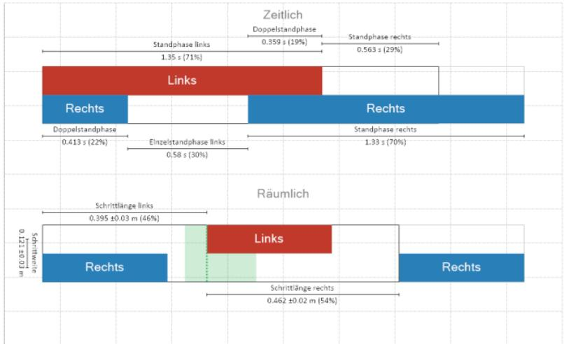
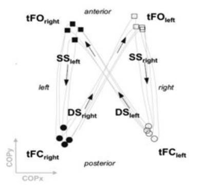
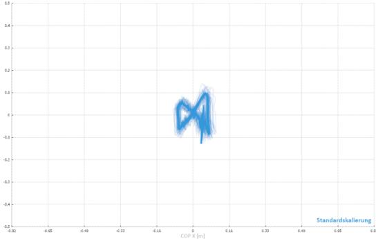
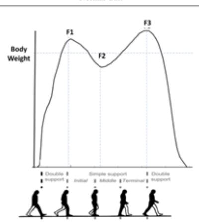
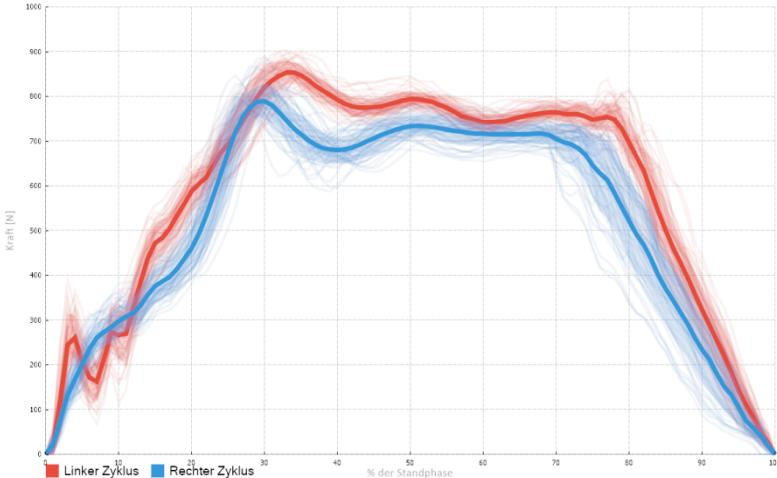
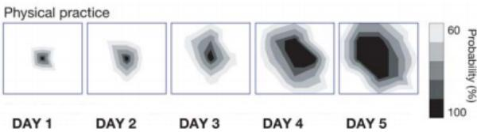

Nextherapy AG Tel. +41 44 216 99 90 Uraniastrasse 9 8001 Zürich nextherapy@hin.ch www.nextherapy.ch

# Datum:

# Patientenangaben

Vor- und Nachname

Adresse

Inkomplette sensomotorische Tetraplegie sub c4, ASIA D

# Arzt / Ärztin

Vor- und Nachname

Versicherung

Name

<table><tr><td>Therapieempfehlung</td><td>Nextherapy AG Tel. +41 44 216 99 90</td></tr></table>

Sehr geehrte Damen und Herren

Im Erstgespräch am 19.01.2023 wurden die Möglichkeiten und Schwierigkeiten der Therapie für Herr XXX besprochen. Nachfolgend die Medizinische Vorgeschichte, die persönlich angepassten Ziele, das Eintrittsassessment, unser Therapievorschlag und die Verordnungsempfehlung.

# Medizinische Vorgeschichte

Herr XXX hatte einen Reitunfall am XX.XX.XXXX und erlitt eine inkomplette sensomotorische Tetraplegie sub C4, Asia D. Er wurde im Balgrist in Zürich nach dem Unfall vier Monate lang behandelt, da hatte er auch Lokomat-Therapie, die für ihn sehr erfolgreich war. Da Herr XXX auch grosse Schwierigkeiten in der Feinmotorik im Alltag hat, würden wir auch Ergotherapie empfehlen. Darum ist es sehr wichtig, dass Herr XXX wieder reguläre Physio - und Ergotherapie bekommt.

Derzeit läuft er mit einem Treckingstock als Hilfsmittel, fühlt sich aber unsicher und unstabil Die rechte Körperhälfte ist stärker betroffen, obwohl auch die linke Seite geschwächt ist.

# Sicherheitsfragen

☐ Depression u/o Angst ☐ Offene Wunde / Dekubitus ☐ Epilepsie ☐ Osteoporose ☐ Katheter/ PEG-Sonden ☐ Schluckstörung ☒ Hör- u/o Sehstörung Lesebrille ☐ Krebs ☒ Gefühlsstörungen ☒ Schmerzen Wo: ab Schulter Wo: Spastik Rückenbereich rechte Qualität: Stechen, brennen, kribbeln, sehr un- Seite mehr betroffen als links. terschiedlich Intensität: VAS: 8/10

<table><tr><td>Therapieempfehlung</td><td>Nextherapy AG</td></tr><tr><td></td><td>Tel. +41 44 216 99 90 Uraniastrasse 9</td></tr></table>

# Angepasste Ziele

Basierend auf der medizinischen Vorgeschichte und dem Gespräch mit Herrn XXX wurden die nachfolgenden persönlichen Ziele identifiziert.

Die persönlich identifizierten Ziele wurde gemäss der Canadian Occupational Performance Measurement (COPM) Skala erfasst. Die COPM schätzt Wichtigkeit, Zufriedenheit und Ausführung von Alltagsaktivitäten auf einer Skala von 1 (gar nicht wichtig) bis 10 (sehr wichtig) ein.

<table><tr><td rowspan=1 colspan=1>Ziele:1 gar nicht wichtig -10 sehr wichtig</td><td rowspan=1 colspan=1>WichtigkeitAusführung</td><td rowspan=1 colspan=1>WichtigkeitAusführung</td><td rowspan=1 colspan=1>Zufriedenheit</td></tr><tr><td rowspan=1 colspan=1>Verbesserung der Rumpfstabilitat</td><td rowspan=1 colspan=1>10</td><td rowspan=1 colspan=1>2</td><td rowspan=1 colspan=1>1</td></tr><tr><td rowspan=1 colspan=1>Schneller gehen</td><td rowspan=1 colspan=1>10</td><td rowspan=1 colspan=1></td><td rowspan=1 colspan=1></td></tr><tr><td rowspan=1 colspan=1>Verbesserung der Handschrift</td><td rowspan=1 colspan=1>10</td><td rowspan=1 colspan=1>2</td><td rowspan=1 colspan=1></td></tr><tr><td rowspan=1 colspan=1>Total</td><td rowspan=1 colspan=1>30</td><td rowspan=1 colspan=1>5</td><td rowspan=1 colspan=1>3</td></tr></table>

Nextherapy AG Tel. +41 44 216 99 90 Uraniastrasse 9 8001 Zürich nextherapy@hin.ch www.nextherapy.ch

# Eintrittassessment

Functional Independance Measurements (FIM):

Von den 126 Punkten möglichen wurden 111 Punkte erreicht. Dabei wurden die grössten Schwierigkeiten im Bereich Kontinenz und Fortbewegung festgestellt.

Der FIM evaluiert die Selbständigkeit in Aktivitäten des täglichen Lebens mithilfe von einem Fragebogen mit 18 Fragen auf einer Skala von 1 (totale Hilfe) bis 7 (totale Unabhängigkeit).

Motricity Index (Beweglichkeits-Index):

Motricity Index gibt Auskunft über die Beweglichkeit der Arme und Beine und wird für die Linke- und Rechtekörperhälfte erhoben.

Die Beweglichkeit der Arme besteht aus den Aufgaben Pinzettengriff, Ellbogenflexion und Schulterabduktion. Die Beinbeweglichkeit wird in sitzender Position in die Kategorien; Knö- chel-Dorsalflexion, Kniestreckung, und Hüftbeugung eingeteilt.

Jede Aufgabe wird in die Skala 0 keine Beweglichkeit bis 33 normale Beweglichkeit eingeteilt.

Von 198 möglichen Punkten von beiden Körperhälften wurden insgesamt 187 Punkte erreicht. Von 99 möglichen Punkten von der rechten Körperhälfte wurden 95 Punkte erreicht. Auf der linken Körperhälfte hat er 92 Punkte, da der linke Fussheber schwächer ist.

6-Minuten Gehtest (6MWT): Misst die Gehdistanz während 6 Minuten.

Die zurückgelegte Distanz in 6 Minuten war bei 312 Meter. Ein Treckingstock wurde als Hilfsmittel gebraucht. Während dem Test wurden keine Pausen durchgeführt und Herr XXX war auch nicht müde.

2-Minuten Gehtest auf C-Mill: Misst die Gang auf einem Laufband Der 2-Minuten Gehtest wurde mit Handlauf ohne Hilfsmittel durchgeführt und zeigte:

Distanz in 2 Minuten: 53,1 Meter bei 1,6km/h Schrittlänge: Die detaillierten Ergebnisse finden Sie im Anhang.

<table><tr><td>Therapieempfehlung 8001 zürich nextherapy@hin.ch</td><td>Nextherapy AG</td></tr><tr><td></td><td>Tel. +41 44 216 99 90 Uraniastrasse 9</td></tr></table>

Räumlich und zeitlich: Der grüne Bereich in den räumlichen Ergebnissen zeigt die durchschnittliche Schrittlänge über den angegebenen Zeitraum. Die gepunktete Linie spiegelt die durchschnittliche linke Schrittlänge. Liegt diese innerhalb des grünen Bereichs, ist das Laufmuster symmetrisch.

  
Gangsymmetrie (CoP-Gaitogramm)

Während des Gehens auf der C-Mill wird der Druckmittelpunkt (CoP) von der Kraftmessplatte erfasst. Das Profil des CoP ist eine sich wiederholende Trajektorie in Form eines Schmetterlings. Anhand dieses Schmetterlings lassen sich einige Merkmale des Gangbildes ableiten. Das folgende Bild zeigt das CoPGaitogramm von Herrn Puch während des Tests.

Während des Tests ist deutlich zu sehen, dass XXX weniger Gewicht auf das rechte Bein verlagert, weil es sich instabiler anfühlt. Die Schrittlängen sind bei der Ganganalyse unterschiedlich. Die rechte Schrittlänge ist $8 \%$ länger als die linke, was in der Schmetterlingsgrafik zu sehen ist, wo man auch die geringe Spurbreite erkennen kann.

Nextherapy AG Tel. +41 44 216 99 90 Uraniastrasse 9 8001 Zürich nextherapy@hin.ch www.nextherapy.ch

Gewichtsverteilung / Aggregierte Kraft

Normal Gait

Das nebenstehende Diagramm zeigt die normale Gewichtsverlagerung beim Gehen.

In den nachstehenden Diagrammen ist die Gewichtsverlagerung von Herr XXX während der durchgeführten Tests dargestellt.

Schwierigkeit des ersten Fersenkontakts und Gewichtsverlagerung.

# Therapievorschlag

Basierend auf den durchgeführten Assessments und den persönlichen gesetzten Zielen, empfehlen wir folgenden Therapievorschlag:

# Mobilität Programm

☐ Erste Bewegungen und Schritte ☐ Funktionelles Gehen ☒ Fortgeschrittenes Gehen

# Balance und Koordination Programm

☐ Basale Rumpf- und Kopfkontrolle   
☒ Anfängliche Gang- und Standsicherheit   
☒ Fortgeschrittene Koordination und Balance sowie Sturzprävention

# Hände, Arme und Aktivitäten des täglichen Lebens Programm

☐ Erste Bewegungen   
☐ Basale Funktionen und Aktivitäten   
☒ Aktivitäten des täglichen Lebens (ADL)   
☐ Partizipationstraining

Nachfolgend einige der Geräte die für die Klient zum Einsatz kommen werden:

☒Amadeo ☒C-Mill ☐Dessintey ☐FES ☐Lokomat Pro ☒Lokomat Nano ☒Pablo ☒Riablo ☒Rysen ☐Sensopro ☒Telko ☒Vibramoov

# Verordnungsempfehlung und Kostenübernahme

Intensität: 2-Mal pro Woche • 2 X pro Woche Physiotherapie • 2 X pro Woche Ergotherapie

<table><tr><td rowspan=1 colspan=1>Physiotherapie-sitzung</td><td rowspan=1 colspan=1>{7311}=77 TP → Basal Neuro-Physiotherapie{7351}=30 TP → Therapie für Kinder unter 6 Jahre alt{7350}=24 TP → Erste Session Beratung</td></tr><tr><td rowspan=1 colspan=1>Ergotherapie-sitzung pro Stunde(KVG)</td><td rowspan=1 colspan=1>4*{7601}=4*24=96 TP →Therapie1.1*{7602}=1.1*18=19.8 TP → Administration</td></tr><tr><td rowspan=1 colspan=1>Ergotherapie-sitzung pro Stunde(UVG /IVG)</td><td rowspan=1 colspan=1>12*{3101}=12*8.32=99.84 TP → Therapie2.2*{3103}=2.2*8.32=18.304 TP →Administration2*{3105}=2*8.32=16.64 TP → Erste Session Beratung</td></tr></table>

Bitte beachten Sie, für die Lokomat-Therapie wird pro Therapieeinheit 2x7311 benötigt.

Damit die persönlichen Therapieziele erreicht werden können, bitten wir Sie um eine Langzeitverordnung für eine entsprechende Kostenübernahme. Das persönliche Therapieprogramm ist für eine kontinuierliche Langzeitbehandlung ausgelegt.

Bei Fragen stehen wir Ihnen gerne zur Verfügung.

Freundliche Grüsse Therapeut:in:

Nextherapy AG Tel. +41 44 216 99 90 Uraniastrasse 9 8001 Zürich nextherapy@hin.ch www.nextherapy.ch

# Die Wissenschaft hinter Nextherapy:

Die Interventionen von Nextherapy haben einen starken Fokus auf Intensität, Wiederholung und Spezifität und beinhalten oft den Einsatz von Robotik und Technologien, um die aktivitätsabhängige Plastizität des Gehirns bestmöglich zu aktivieren, was signifikant positive Auswirkungen auf die Genesung von Hirnschäden haben kann (Kwakkel G, 2004; Veerbeek J.M 2014; Spiess M.R, 2017; Schneider E, 2016).

Intensivprogramme mit 25 bis 30 Therapiestunden pro Woche haben Verbesserungen gezeigt, die doppelt so hoch sind wie bei anderen Interventionen mit geringerer Intensität (Daly J et al 2019; Lohse KR et al 2014; Lang CE et al 2016; Rodgers H, 2019). Intensität ist ein wichtiger Faktor für die Genesung (Kwakkel G, 2004; Veerbeek J.M, 2014; Spiess M.R, 2017; Schneider E, 2016) und es gibt genügend Hinweise darauf, dass klinisch signifikante Verbesserungen Monate oder Jahre nach der Verletzung möglich sind, wenn ausreichend Therapie durch Erhöhung der Plastizität bereitgestellt wird und somit ein neues Fenster für Genesung eröffnet wird (Mc Cabe J, 2015; Daly J 2019; Ward N, 2019).

  
Fig2: Veränderungen im Gehirnbereich, die die Finger nach 5 Tagen Training darstellt. (PascualLeone et al 2005).

Eine Hypothese ist, dass es strukturelle, plastische Veränderungen auslöst (Maier M, 2019), die die neuronalen Netze des Gehirns neu organisieren (Kwakkel et al 2015), die kortikale Erregbarkeit erhöhen oder normalisieren und zu nachhaltigen Veränderungen in unserem Gehirn führen (Liepert et al 2000; Schaechter et al 2004).

In Studien haben die Patienten keine Hindernisse in Bezug auf die Durchführung von Programmen mit höherer Intensität wahrgenommen und waren positiv gestimmt, härter zu arbeiten (Janssen J, 2020). Erste objektive Beurteilungen und der Einsatz von Sensoren und Technologien unterstützen Therapeuten dabei, die Patienten stärker anzutreiben (Connell L, 2018).

  
Fig1. Verbesserung der Arm- und Handfunktion bei Schlaganfallpatienten >1 Jahr nach Schlaganfall (Daly et al 2019).

Die während der Therapie durchgeführten Aufgaben müssen den zu erfüllenden Aufgaben so ähnlich wie möglich sein (Schmidt R.A, 2018). Aufgabenspezifisches Training induziert plastische Veränderungen in unserem Gehirn und verbessert motorisches Lernen und Gedächtnisleistung (Boyd et al 2010; Pascual-Leone et al 2005).

  
Fig3: Veränderungen im Gehirn nach dem Training zeigen die Fähigkeit des Gehirns, sich zu verändern, was zur Verbesserung der Funktionen beiträgt (Pascual-Leone et al 2005)